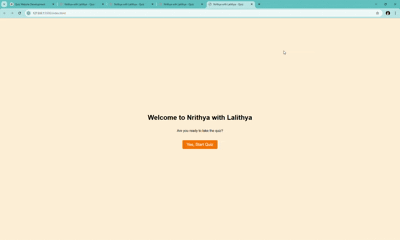
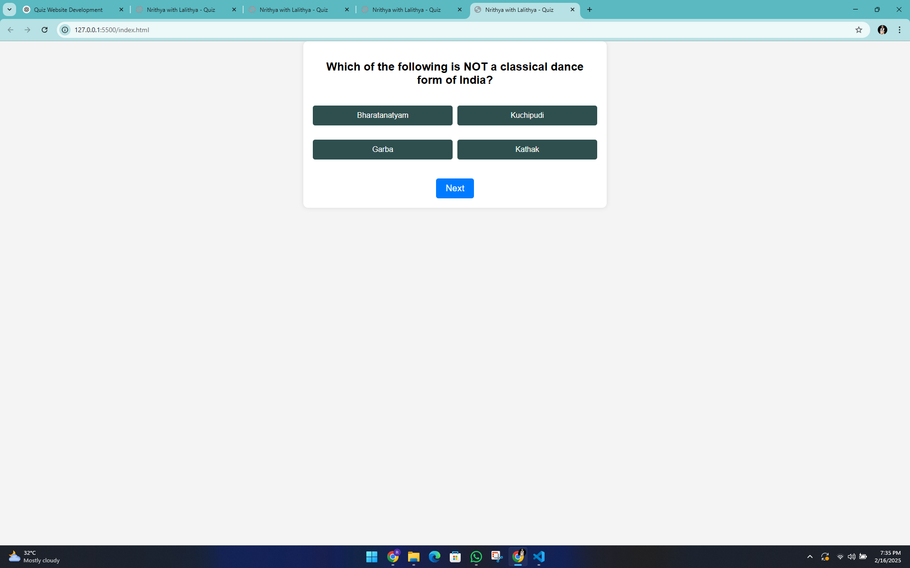

# 📜 Indian Classical Dance Quiz - Nrithya with Lalithya

A simple and interactive **Quiz Website** built using **HTML, CSS, and JavaScript**, featuring 20 multiple-choice questions on **Indian Classical Dance**.

---

## 📌 Features  
✅ **Welcome Screen** – Displays the quiz title and a "Start Quiz" button.  
✅ **Quiz Page** – 10 multiple-choice questions with 4 options each.  
✅ **User Selection** – Users can select answers, which are highlighted.  
✅ **Next Button** – Moves to the next question after selection.  
✅ **Result Page** – Displays the final score (e.g., **"You scored 15/20"**).  
✅ **Responsive Design** – Optimized for both mobile and desktop screens.  

---
## 🛠️ Technologies Used  
- **HTML** – Structuring the quiz pages  
- **CSS** – Styling and layout improvements  
- **JavaScript** – Quiz logic, user interactions, and scoring  

---
🚀 Live Demo: (https://ramalalithya.github.io/Quiz/) 

## 📸 Screenshots

